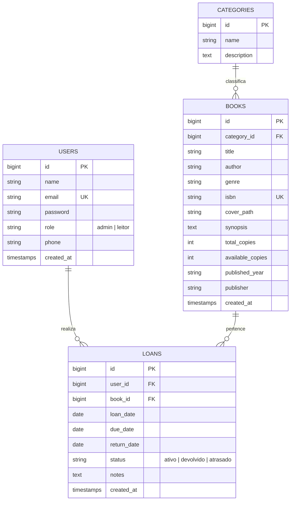

# 📚 Sistema de Gestão de Biblioteca

Projeto Semestral da disciplina de **Desenvolvimento Web II**.

Sistema completo de gerenciamento de acervo bibliográfico, usuários e empréstimos com front-end desacoplado em **React (SPA)**, back-end API RESTful em **Laravel 11**, banco de dados relacional **PostgreSQL** e integração com a **Google Books API / Open Library API**.

---

## 🚀 Tecnologias Utilizadas

### **Front-end**
- **React (Vite)**
- **Tailwind CSS**
- **React Router DOM**
- **Axios**
- **Lucide Icons**
- **Hospedagem:** [Vercel](https://vercel.com)

### **Back-end**
- **PHP 8.3**
- **Laravel 11** (API RESTful)
- **Laravel Sanctum** (Autenticação e Sessão)
- **PHPUnit** (Testes automatizados)
- **Hospedagem:** [Render](https://render.com) (Container Docker)

### **Banco de Dados & Storage**
- **PostgreSQL 16**
- **Hospedagem do Banco:** [Supabase](https://supabase.com)
- **Upload de Arquivos:** `Laravel Storage` (Capas de Livros e Anexos)

---

## 🏛️ Arquitetura e Modelagem de Dados (DER)



---

## 🐳 Executando Localmente com Docker Compose

### Pré-requisitos
- [Docker Desktop](https://www.docker.com/products/docker-desktop/) e Docker Compose instalados.

### Passo a passo
1. Clone o repositório:
```bash
git clone <URL_DO_REPOSITORIO>
cd "trabalho semestral DESWEB2"
```

2. Suba os containers com um único comando:
```bash
docker compose up -d --build
```

3. Execute as migrations e carregue os dados de teste (Seeders):
```bash
docker compose exec backend php artisan migrate:fresh --seed
```

4. Acesse:
- **API Laravel:** [http://localhost:8000](http://localhost:8000)
- **Documentação de Rotas / Healthcheck:** [http://localhost:8000/up](http://localhost:8000/up)

---

## ☁️ Deploy 100% na Nuvem

1. **Banco de Dados (Supabase):**
   - Crie um projeto gratuito no [Supabase](https://supabase.com).
   - Copie as credenciais de conexão do PostgreSQL (`Host`, `Database`, `User`, `Password`, `Port 5432` ou `6543`).

2. **Back-end (Render):**
   - Crie um novo **Web Service** no [Render](https://render.com) conectado ao repositório GitHub.
   - Selecione a opção **Docker** (Root Directory: `./backend` ou deixe a raiz apontando para o Dockerfile).
   - Adicione as variáveis de ambiente: `DB_CONNECTION=pgsql`, `DB_HOST=...`, `DB_DATABASE=...`, `DB_USERNAME=...`, `DB_PASSWORD=...`, `APP_KEY=...`, `FRONTEND_URL=https://seu-front.vercel.app`.

3. **Front-end (Vercel):**
   - Conecte o repositório no [Vercel](https://vercel.com) com Root Directory em `frontend`.
   - Configure a variável de ambiente: `VITE_API_URL=https://seu-backend.onrender.com/api`.

---

## 🧪 Testes Automatizados

Para rodar a suíte de testes com PHPUnit:
```bash
cd backend
php artisan test
```

---

## 👥 Credenciais de Teste Padrão (Seed)

- **Administrador:**
  - **E-mail:** `admin@biblioteca.com`
  - **Senha:** `password123`
  - **Perfil:** `admin` (acesso total)

- **Leitor / Aluno:**
  - **E-mail:** `leitor@biblioteca.com`
  - **Senha:** `password123`
  - **Perfil:** `leitor` (visualização de catálogo e solicitação de empréstimos)